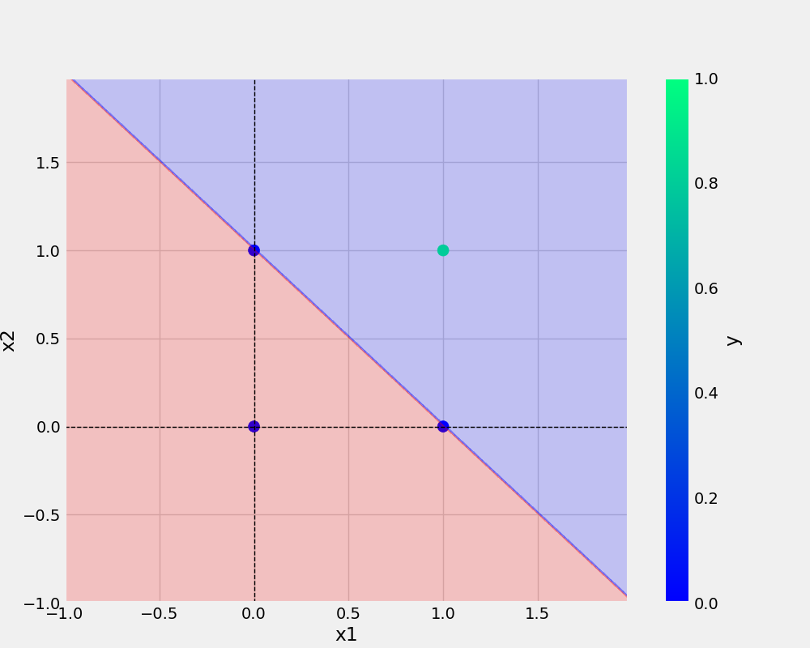

# oneNeuron
oneNeuron | Perceptron


# commands used -

```bash
git add . && git commit -m " docstrings updated" && git push origin main
```

```bash
cp Research\ notebooks/demo.ipynb .
```

 <a href="https://www.w3schools.com">Visit W3Schools.com!</a> 


## Add URL -
[GitHub Handbook](https://guides.github.com/introduction/git-handbook/)

## Add image -


  